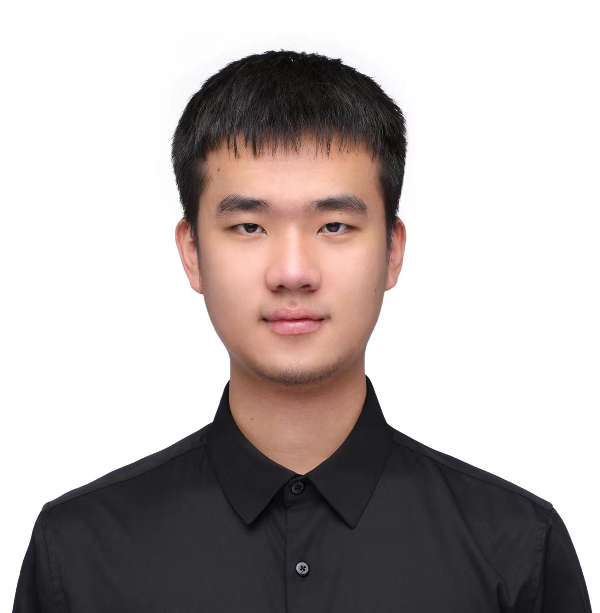

 This is the homepage of the **AI Privacy & Security (AI-PriSec) Interest Group**. It brings together researchers and practitioners around the world broadly interested in this topic. For the time being, it features recurring seminars, a couple of times a month, always on Sunday, around 10 AM (HK Time).  

### Get Involved
- TBA

### Upcoming Seminars

- 28 February 2022, 10:00 ([HK time](https://www.timeanddate.com/worldclock/fixedtime.html?msg=Seminar&iso=20220228T10&p1=102))  
**Zijing Ou (Tencent AI Lab)**  
Model Explanation with Shapley Values  
[[WeMeet Registration](https://meeting.tencent.com/dw/TSnpIDWx9GXP)] [[Live Stream](https://meeting.tencent.com/dw/TSnpIDWx9GXP)]
 **Abstract:** Deep neural networks (DNNs) become increasingly important in many applications while lacking explanations for their excellent performance. **Shapley Value** provides a theoretical and practical explainer for DNNs. In this talk, the presenter will introduce the most recent progress in model explanation with Shapley value, including its estimation, uncertainty, and potential research areas.  **Bio:** Zijing Ou recently graduated with a B.E. degree from Sun Yat-sen University and now works as an intern in Tencent AI Lab. His research interests include approximate inference, energy-based models, and interpretable AI. His research has been published at venues including IJCAI, ACL, EMNLP, etc. He also works as a reviewer for ICML, IJCAI, ACL, etc. Home: [https://j-zin.github.io/](https://j-zin.github.io/) 

<!-- <iframe width="560" height="315" src="https://www.youtube.com/embed/Dn_NkH-IEVA" title="YouTube video player" frameborder="0" allow="accelerometer; autoplay; clipboard-write; encrypted-media; gyroscope; picture-in-picture" allowfullscreen></iframe> -->

### Organizers
- Prof. Yi Wu, HLJU, Harbin
- [Mr. Yi Liu](https://yiliucs.github.io/), CityU, Hong Kong
- [Mr. Zijing Ou](https://j-zin.github.io/), Tencent AI Lab, Shenzhen
- TBA

